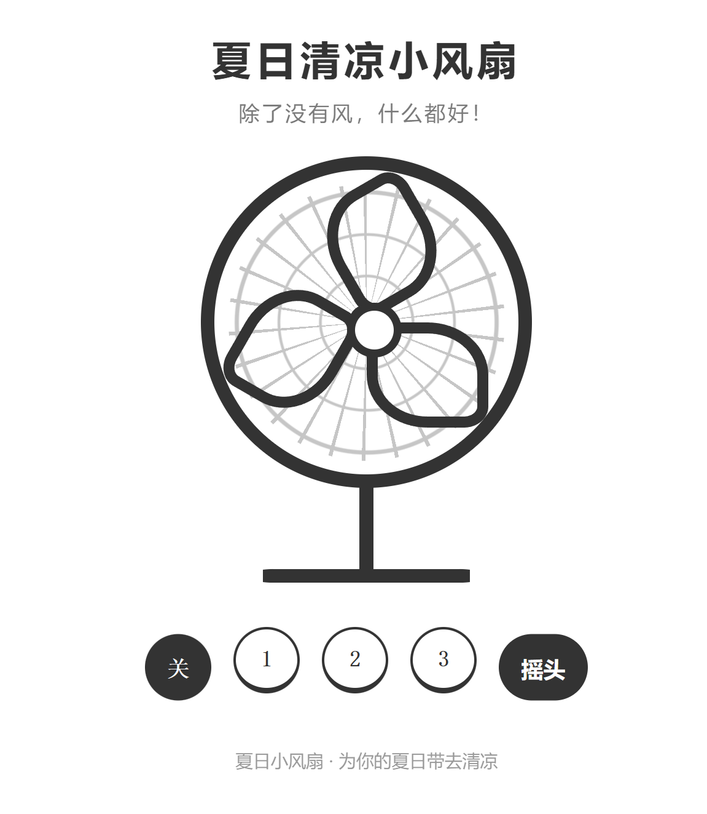

[简中](https://github.com/Anan-up/Small-fan/blob/main/README.md) | [文言](https://github.com/Anan-up/Small-fan/blob/main/README_Classical_Chinese.md) | [English](https://github.com/Anan-up/Small-fan/blob/main/README_English.md)

# Summer Breeze Fan

This is a **pure front-end, single-file fun webpage** — the "Summer Cooling Fan," a self-deprecating little toy project. Just open it and play.

## Project Overview

| Item | Details |
|------|---------|
| Form | A single `index.html` (~34KB), zero dependencies, zero build |
| Tech | Vanilla HTML + CSS + JS, no frameworks |
| External resources | None — two sound effects (fan hum, button click) are embedded as base64 |
| Features | Three fan speeds, oscillation toggle, fan sound effects, dark mode |

## Structure Breakdown

**1. A fan drawn entirely in CSS**
- Outer ring + grille (concentric circles via `radial-gradient` + radial lines via `repeating-conic-gradient`) + center cap — all drawn with pseudo-elements and gradients, not a single image
- Three blades shaped with `border-radius: 20% 50%`, each rotated 120° apart
- Add a neck and a base, and you have a complete desk fan

**2. Physics-feel animation**
- Driven by `requestAnimationFrame`; blade angular velocity approaches its target with first-order inertia: **fast spin-up (τ=0.9s), slow spin-down (τ=2.2s)** — after power-off the blades coast to a stop instead of freezing instantly
- Three speeds: 540°/s, 720°/s, 1350°/s
- Oscillation: smoothly ramped swing amplitude (±5°, 4.5s period); when oscillation is switched off, the fan naturally returns to center without "snapping"
- A `dt` cap of 0.1s prevents angle jumps when returning from a background tab

**3. Web Audio sound effects**
- The fan hum is a looping source; when switching speeds, **volume and pitch (playbackRate) transition exponentially, like a real motor** (`setTargetAtTime`)
- Audio is initialized and decoded on first click (to bypass browser autoplay restrictions), with silent fallback on failure

**4. Attention to detail**
- Follows the system dark mode (black/white palette via CSS variables)
- Respects `prefers-reduced-motion`: oscillation is automatically disabled for users who prefer reduced motion
- Buttons have `focus-visible` focus styles and a skeuomorphic pressed-down effect; touch screens supported (tap highlight removed)

## project screenshot

